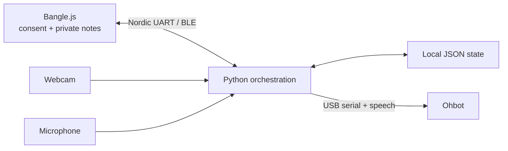

# Codebase guide

This guide is the source-oriented companion to the operator instructions in the
root [`README.md`](../README.md). It documents the executable entry points,
module boundaries, runtime state, and important differences between the
intended design and the current prototype.

## 1. System at a glance

The laptop is the orchestrator. It receives consent answers from a Bangle.js
watch over BLE, senses bystanders through a webcam or microphone, persists local
identity, consent, and reminder records, and drives an Ohbot over USB serial.
The watch is both the owner-presence proxy (its BLE link) and the private UI.



Every flow shares one trigger: a **scheduled reminder becoming due**. A reminder
is private content the owner recorded ahead of time (e.g. a doctor's appointment)
with a due time and a sensitivity label; there is no heart-rate gate. There are
three operating flows:

1. **Camera reminder flow** — when a reminder is due it is delivered gated by who
   the webcam sees. `camera_remember` remembers each bystander's decision and
   reuses it; `camera_reask` always asks again.
2. **Voice reminder flow** — the microphone mirror of the camera pair:
   `mic_remember` remembers each bystander's decision and reuses it, while
   `mic_reask` always asks again and stores nothing. Both are thin wrappers over
   the shared voice engine `robot.core.voice_reminder`, which keeps the mic off
   until a reminder is due, records the pre-reminder window, and delivers gated by
   who the mic hears. The engine imports `robot_io.py` as a support module.
3. **Reminder creation** — `add_reminder.py` records the owner speaking a
   reminder, transcribes and dates it, classifies its sensitivity, and stores it
   in `reminders.json`.

The two consent-memory policies — cache-memory ("remember") and re-consent
("reask") — apply per modality, not just to the camera, so the delivery apps form
a 2x2 of sensing modality (camera / mic) by policy: `camera_remember`,
`camera_reask`, `mic_remember`, and `mic_reask`. "Remember" stores a bystander's
Yes/No and reuses it (the thesis's "remembers their privacy preferences" Privacy
Management arm); "reask" asks the watch every time and stores nothing (the consent
baseline / control). `mic_reask` is the newest of the four — previously only the
camera had a re-consent baseline.

## 2. Entry points

Run commands from the repository root as shown below; the apps are Python
modules launched with `python -m robot.apps.<name>`.

| Entry point | Purpose | Required preparation | How it stops / interacts |
| --- | --- | --- | --- |
| `python -m robot.apps.enroll_face` | Create `owner_face.json` from 12 camera samples. | Webcam; YuNet/SFace models download on first use. | `q` in the preview; terminal confirmation only when overwriting an enrollment. |
| `python -m robot.apps.enroll_voice` | Create `owner_voice.json` from 20 voiced-window embeddings. | Microphone and voice dependencies. | `q` in the status window; terminal confirmation only when overwriting. |
| `python -m robot.apps.camera_remember` | Reminder-triggered camera delivery with owner subtraction and per-bystander consent memory (cache-memory policy). | Face enrollment; flashed watch; a due reminder; Ohbot or `NO_OHBOT=1`. | `q` in the camera window. |
| `python -m robot.apps.camera_reask` | Reminder-triggered camera control condition that always prompts and never stores a decision (re-consent policy). | Same as the camera memory app. | `q` in the camera window. |
| `python -m robot.apps.add_reminder` | Record, transcribe, parse, classify sensitivity, confirm, and store one reminder. | Microphone; Whisper, dateparser, and the sensitivity classifier. | Terminal `yes/switch/retry/quit` confirmation. |
| `python -m robot.apps.mic_remember` | Voice cache-memory app (thin wrapper over `robot.core.voice_reminder`): poll reminders with the mic off, record the pre-reminder window, deliver a due reminder, and remember each bystander's Yes/No. | Voice enrollment, reminder, watch, and Ohbot or fallback. | `Ctrl-C`. |
| `python -m robot.apps.mic_reask` | Voice re-consent counterpart to `mic_remember` (same wrapper): identical delivery but re-asks the watch every time and stores no decision. | Same as `mic_remember`. | `Ctrl-C`. |
| `python -m robot.apps.fusion_remember` | Fused mic→camera delivery (thin wrapper over `robot.core.fusion_reminder`): listens across the window, opens the camera for a head scan only if the mic heard nobody, remembers each bystander's Yes/No in `consent_cache_fusion.json`. | Voice **and** face enrollment (unless `--no-camera`); reminder; watch; Ohbot or `NO_OHBOT=1`. | `Ctrl-C`. |
| `python -m robot.apps.fusion_reask` | Re-consent counterpart to `fusion_remember` (same wrapper): identical sensing, but asks the watch every time and stores nothing. | Same as `fusion_remember`. | `Ctrl-C`. |
| `python -m robot.apps.reminder_app` | **Unified interactive app**: asks two startup questions — remember disclosure decisions? (yes → cache-memory / no → re-consent) and which sensors? (1 → mic only / 2 → mic then camera) — then runs the matching engine with the split T−7 min wake / 5-min recording timeline and fail-safe camera handling. CLI flags (`--policy`, `--sensors`, `--monitor-lead`, `--listen-duration`) pre-answer questions; answers are never persisted. | Voice enrollment (mic mode) or voice + face enrollment (both mode); reminder; watch; Ohbot or `NO_OHBOT=1`. | `Ctrl-C` (also exits the startup questions cleanly, before any hardware is touched). |
| `python -m pytest tests/` | Hardware-free automated tests for the reminder pipelines and the unified app (mocked mic/camera/watch/robot; no downloads, no network). | `pip install -r requirements.txt` (includes `pytest`). | Exits after the run. |
| `python robot/bench/bench_camera.py` | Compare camera algorithms in isolated subprocesses. | Base dependencies; optional challenger packages/models. | Exits after writing result tables. |
| `python robot/bench/bench_voice.py` | Compare voice algorithms in isolated subprocesses. | Base dependencies; optional challenger packages/models. | Exits after writing result tables. |
| `python robot/bench/capture_eval_set.py ...` | Capture labelled face or voice evaluation data. | Camera or microphone. | Mode-specific count, or `q` for face capture. |

The live consent demos do not read decisions from the terminal. Enrollment and
reminder creation are offline setup operations and do use terminal confirmation.

## 3. Runtime flows

### 3.1 Camera reminder flow

The main thread opens the webcam and runs the inexpensive Haar detector on every
frame only to show a live face count. Every `REMINDER_POLL_S` (1 s) it re-reads
`reminders.json`. When a reminder becomes due and the watch (the owner-presence
link) is connected, the main thread hands a copy of the current frame to a daemon
delivery worker, which runs the policy off the UI thread:

1. A **non-sensitive** reminder is spoken immediately — no presence check, no
   consent.
2. For a **sensitive** reminder, YuNet detects faces on the snapshot and SFace
   produces one 128-dimensional embedding per face.
3. The best face matching the owner template is removed; owner presence is proven
   by the watch link, so the owner need not be on camera.
4. `FaceDB` matches or creates stable IDs for the remaining (bystander) faces.
5. Sorted, unique IDs form a group key such as `person_001:person_003`.
6. With no bystander in view the reminder is spoken (owner alone). Otherwise the
   cache-memory demo looks up `(group key, "reminder")`; the re-consent demo
   skips this lookup.
7. A cache miss (or every re-consent prompt) is sent to the watch. `YES` speaks
   the reminder (`"Here is your reminder. <text>."`); `NO` pushes the reminder
   privately to the wrist via `notify(...)` and the Ohbot only greets neutrally
   (`"Hello there."`); a timeout or link failure withholds the same way but is
   not cached. Only an explicit Yes/No is cached.

The delivery worker keeps face recognition, the BLE round-trip, and speech off the
camera UI thread. A due reminder fires once — it is marked delivered even if the
worker raises — and is held while the watch is offline.

### 3.2 Voice reminder flow

`mic_remember` and `mic_reask` are the voice entry points — thin wrappers over the
shared engine `robot.core.voice_reminder` that differ only in the consent-memory
policy (cache-memory vs re-consent). The microphone stays **off** until a
reminder falls within its lead window (default five minutes, `--lead`). A
**non-sensitive** reminder is simply spoken at its due time; the mic never opens.

For a **sensitive** reminder the runner records the whole lead window
**continuously** — no on/off sampling — and analyses the single recording once, at
the due time:

1. A dual energy test over 100 ms blocks marks the window as containing a voice if
   it is either *sustained* (a fraction of blocks above `--gate` reaches
   `--min-voiced`) or *bursty* (at least two blocks exceed the louder `--peak`).
   The bursty test is tuned to catch a distant bystander whose average level is
   low but whose syllables peak.
2. If a voice is present, Resemblyzer embeds roughly 1.6-second voiced windows;
   windows matching `owner_voice.json` are subtracted, and the remaining non-owner
   windows are averaged into **one** stable bystander ID, matched or minted in
   `voice_db.json`.
3. Consent is deliberately deferred to the **due time**: if no non-owner voice was
   heard the reminder is spoken (owner alone). Under `mic_remember` a remembered
   bystander reuses their stored Yes/No under the `(speaker group, "reminder")`
   consent key and an unknown bystander is asked on the watch only then; under
   `mic_reask` the watch is asked every time and no decision is stored. Either way
   the prompt buzzes when the reminder is actually due rather than minutes early.
4. `YES` speaks the reminder; `NO` or no reply pushes the reminder text privately
   to the watch and the robot greets neutrally.

Owner presence is re-checked at the due time from the watch link; if the owner left
during the window the reminder is held. This is speaker-window matching, not source
separation or diarisation: a bystander who stays completely silent for the whole
window cannot be heard and is treated as absent (the camera flow covers silent
presence).

### 3.2b Unified reminder app flow (`reminder_app`)

`python -m robot.apps.reminder_app` is one interactive entry point over the same
engines. Startup order matters: **first** the two questions (consent policy:
remember/reask; sensors: mic only / mic-then-camera), with invalid answers
re-prompted and `Ctrl-C`/EOF exiting cleanly **before** any model, device, or
BLE initialisation; **then** a printed configuration summary; **then** the
selected engine starts (`run_config` on `robot.core.voice_reminder` or
`robot.core.fusion_reminder`). CLI flags `--policy` / `--sensors` bypass the
matching question; `--monitor-lead` / `--listen-duration` set the timing. The
choices are never persisted — the next interactive run asks again.

Per reminder scheduled at T (defaults 420 s / 300 s):

1. **T−7 min** — wake, resolve sensitivity (stored flag or live classifier),
   and confirm owner presence via the watch BLE link. Watch offline → the
   reminder is **held**; no sensor opens, nothing is spoken, and the BLE client
   keeps rescanning in the background.
2. **Sensitive** → the mic records continuously for exactly 5 minutes
   (T−7 → ~T−2), then closes; the recording is analysed immediately (energy
   gate → Silero VAD → speaker embedding → owner subtraction → voice gallery)
   and the raw audio is dropped. **Non-sensitive** → both sensors stay off and
   the reminder is simply spoken at T (owner presence re-confirmed).
3. A non-owner voice ⇒ that identity is the bystander; the camera is never
   opened. No voice + **both-sensor mode** ⇒ the head-mounted camera opens only
   for a head scan, scheduled so the freshest practical scan finishes close to
   T (`HeadScanner` + `LatestFrame` + `identify_people_in_frames`); the head is
   re-centred and the camera released in every path. No voice + mic-only mode ⇒
   "no audible bystander".
4. **At T** — owner presence is re-confirmed (owner gone → hold, stale presence
   discarded). No bystander → speak. Bystander → the selected consent policy on
   the watch: remember mode reuses an explicit stored Yes/No and asks only on a
   cache miss (storing only explicit answers); reask mode always asks and never
   touches a consent store. Yes → speak aloud; No / timeout / disconnect →
   private wrist note + neutral greeting, and the non-answer is never cached.
5. **Failure = privacy-safe**: a failed camera open, missing frame, failed
   scan, unusable audio, or failed identity analysis is never read as "owner
   alone" — the fused engine runs fail-safe here and withholds privately.
   Transient errors leave the reminder pending with bounded retries; on final
   give-up it is pushed privately to the watch rather than lost silently.

### 3.3 Reminder creation and sensitivity

`add_reminder.py` records a fixed-length clip (default eight seconds), runs
the local Whisper model, uses dateparser to find a future local date/time, and
classifies the reminder **sensitive or not** with `sensitivity.py` before asking
the operator to confirm. At the confirm step the operator can press `s` to flip the
sensitivity label, `y` to save, `r` to retry, or `q` to quit; the result is stored
in `reminders.json` with its `sensitive` flag.

`sensitivity.py` embeds the reminder text with a local sentence-transformer
(`all-MiniLM-L6-v2`) and compares it by cosine similarity to small labelled
prototype sets (sensitive vs everyday), with a high-precision keyword override for
explicit medical/financial terms. It runs entirely offline; on a near-tie it
defaults to sensitive (the privacy-safe side), and it falls back to a keyword
heuristic if `sentence-transformers` is unavailable. This is the same
embedding-plus-cosine family used by the voice (Resemblyzer d-vectors) and face
(SFace) identity models, applied to text.

Both delivery modalities then share one policy at the due time: a non-sensitive
reminder is spoken with no presence check; a sensitive reminder with the owner
alone is spoken; a sensitive reminder with a bystander present asks the watch for
consent, disclosing on `YES` and otherwise pushing the text privately to the wrist.
Delivery guarantees differ by modality: the camera demos mark a reminder delivered
once the worker finishes even if it raised (**at-most-once attempt**), while the
voice engine `robot.core.voice_reminder` behind `mic_remember` / `mic_reask`
leaves a failed attempt pending and retries it a bounded number of times before
giving up. In every case `notify(...)` is a fire-and-forget BLE
write with no acknowledgement, and a silent bystander produces the owner-alone
branch. These constraints matter when interpreting a user study.

## 4. Module ownership

The Python package is `robot/`, organised into layers: `apps/` holds the runnable
entry points (`python -m robot.apps.<name>`); `core/` holds the domain logic,
robot I/O, and consent; `perception/` holds sensing and identity; `bench/` holds
the algorithm-comparison benchmark; and `state/` holds gitignored runtime data and
downloaded ONNX weights. On-disk data-file paths are centralised in
[`robot/paths.py`](../robot/paths.py).

| Path | Responsibility |
| --- | --- |
| [`bangle/consent_app.js`](../bangle/consent_app.js) | UART frames, watch-mediated Yes/No consent prompt, buzzer, and one-way private-note UI; the idle screen shows the "Robot linked / consent ready" status. |
| [`robot/core/policy.py`](../robot/core/policy.py) | Background BLE event loop, owner-presence link state (`is_connected`), consent correlation/timeouts, watch notifications, and JSON consent memory. |
| [`robot/perception/face_id.py`](../robot/perception/face_id.py) | YuNet/SFace model acquisition and face detection/embedding. |
| [`robot/perception/voice_id.py`](../robot/perception/voice_id.py) | Resemblyzer preprocessing, segmentation, and speaker embeddings. |
| [`robot/core/owner.py`](../robot/core/owner.py) | Modality-independent, single-owner embedding store and cosine match. |
| [`robot/perception/face_db.py`](../robot/perception/face_db.py) | Modality-independent embedding gallery despite its historical class/file name; assigns `person_NNN`. |
| [`robot/perception/audio_device.py`](../robot/perception/audio_device.py) | Shared PortAudio input-device selection and `VOICE_INPUT_DEVICE` handling. |
| [`robot/perception/camera_device.py`](../robot/perception/camera_device.py) | Shared camera selection (`CAMERA_DEVICE`/`CAMERA_RES`), defaulting to the head-mounted USB webcam, plus capture warm-up and a black-frame check. |
| [`robot/core/head_scan.py`](../robot/core/head_scan.py) | Head sweep before a sensitive delivery: `LatestFrame` hands the newest frame from the capture loop to the delivery worker, and `HeadScanner` turns the head through `HEAD_SCAN_POSITIONS`, waiting for a frame captured after the head settled. |
| [`robot/perception/presence.py`](../robot/perception/presence.py) | Identifies everyone across the sweep's frames, clustering repeat sightings of one person (across frames only, never within a frame) so a bystander gets one gallery ID and one consent key. |
| [`robot/core/reminders.py`](../robot/core/reminders.py) | Reminder data model (including the `sensitive` flag), due/pending queries, and atomic JSON persistence. |
| [`robot/core/sensitivity.py`](../robot/core/sensitivity.py) | Local sentence-transformer sensitivity classifier: cosine-matches reminder text to labelled prototypes with a keyword override, or a keyword-only fallback when the model is absent. |
| [`robot/core/robot_io.py`](../robot/core/robot_io.py) | Shared voice support module (not runnable): Ohbot glue, on-disk paths, reminder templates, `deliver_reminder_spoken`, `behavior_withhold`, and `identify_bystander_averaged`; imported by the voice engine `robot.core.voice_reminder`. |
| `robot/apps/camera_remember.py`, `robot/apps/camera_reask.py`, and the thin `robot/apps/mic_remember.py` / `robot/apps/mic_reask.py` wrappers over [`robot/core/voice_reminder.py`](../robot/core/voice_reminder.py) | Reminder-triggered delivery: presence gating, worker/loop lifecycle, identity orchestration, consent decisions, HUD/logging, and Ohbot behavior. |
| `robot/apps/enroll_face.py`, `robot/apps/enroll_voice.py` | One-time template capture, average/L2 normalization, persistence, and live verification. |
| [`ohbot/ohbotData/`](../ohbot/ohbotData/) | Ohbot SDK motor, speech, and settings assets; application orchestration remains in the Python demos. |

The historical names `FaceDB` and `face_db.py` are misleading in the voice
pipeline: the implementation accepts any flat float32 embedding and is reused
for 256-dimensional speaker vectors.

## 5. Concurrency and shutdown

| Context | Work |
| --- | --- |
| Main thread | Camera/audio status, reminder polling, delivery gating, and (camera demos) the OpenCV UI. |
| BLE thread | `asyncio` scan/connect, UART notifications, chunked writes, pending consent futures. |
| Delivery worker (camera demos) | Identity embedding, cache lookup, blocking consent request, and Ohbot speech. |
| Background recording (voice runner) | `sd.rec` fills the lead-window buffer while the main loop waits; it is analysed once at the due time. |

In the camera demos only one delivery worker may own the delivery slot at a time
(`trial_lock` / `in_trial`). Ohbot calls are guarded by `ohbot_lock`, and the JSON
stores have their own locks. The delivery workers are daemon threads so process
exit is not held hostage by a pending prompt.
`BangleClient.close()` signals the BLE loop; it does not join it. Shutdown waits
up to ten seconds for the Ohbot lock before allowing process exit to release the
serial port.

## 6. Interfaces

### Bangle.js Nordic UART protocol

The protocol is newline-delimited UTF-8 carried over the Nordic UART Service.

| Direction | Frame / expression | Meaning |
| --- | --- | --- |
| Watch → laptop | `CONSENT:<id>:YES` | Affirmative response for a prompt ID. |
| Watch → laptop | `CONSENT:<id>:NO` | Negative response for a prompt ID. |
| Laptop → watch | `consent("<id>","<message>");` | Buzz and display a correlated Yes/No prompt. |
| Laptop → watch | `notify("<message>");` | Buzz and display a one-way private note with OK. |

Laptop-to-watch expressions are JSON-string encoded and split into writes of at
most 20 bytes, with a five-millisecond inter-chunk delay. A leading newline
flushes stale REPL input. The watch disables REPL echo on load and reconnect;
the laptop additionally strips leaked `>` prompts.

The consent timeout is owned by the laptop (`CONSENT_TIMEOUT_S`, 30 seconds in the
demos); the watch also auto-dismisses an unanswered prompt after ~30 seconds
without replying. A disconnect or timeout returns `None`, which is distinct from
`False`; the delivery policy withholds and does not cache `None`.

### Ohbot

The demos configure espeak, initialize the port hint, and serialize all
movement/speech calls. On macOS they replace the SDK playback hook with
`afplay`. `NO_OHBOT=1` bypasses serial initialization and uses `say` on macOS or
`espeak` on Linux.

## 7. Runtime data and schemas

All stores live under `robot/state/`. Embeddings are base64-encoded
float32 arrays: 128 values for faces and 256 for voices. Do not treat a base64
embedding as anonymous data; it is a biometric template.

### Owner template

Used by `owner_face.json` and `owner_voice.json`:

```json
{
  "enrolled_at": "2026-07-14T12:30:00",
  "samples": 12,
  "embedding": "<base64 float32 bytes>"
}
```

### Identity gallery

Used by `face_db.json` and `voice_db.json`:

```json
{
  "next_id": 2,
  "people": [
    {"id": "person_001", "embedding": "<base64 float32 bytes>"}
  ]
}
```

The first unmatched observation is frozen as the gallery record. Matches do not
update or average that record, and deleted IDs are not reused.

### Consent memory

Used by `consent_cache.json` and `consent_cache_voice.json`:

```json
{
  "person_001": {
    "reminder": "NO"
  },
  "person_001:person_003": {
    "reminder": "YES"
  }
}
```

A group is a distinct key: consent for `person_001` does not imply consent for
`person_001:person_003`. Camera and voice galleries are separate namespaces. All
reminders share the single `reminder` content type, so a bystander's Yes/No is
reused for every reminder rather than re-asked per item.

### Reminder store

Used by `reminders.json`:

```json
{
  "next_id": 2,
  "reminders": [
    {
      "id": "rem_001",
      "text": "Doctor's appointment on July 20th at 3 PM",
      "remind_at": "2026-07-20T15:00",
      "delivered": false,
      "sensitive": true
    }
  ]
}
```

Reminder timestamps are naive local datetimes with minute precision. There is
no timezone or daylight-saving migration logic. The `sensitive` flag is set by the
classifier at add time and selects the delivery policy; it is `null` for a reminder
saved before the field existed, in which case the runner classifies the text on the
fly.

All four store implementations rewrite a small whole JSON document through a
same-directory temporary file and `os.replace`. If loading fails, they log the
problem and start with empty in-memory state. All of `robot/state/` — biometric
templates, caches, and `reminders.json` — is gitignored; keep it out of commits
because reminder text may be sensitive.

## 8. Configuration

### Environment variables

| Variable | Default | Consumers | Effect |
| --- | --- | --- | --- |
| `OHBOT_PORT` | `Pico` | Demos and reminder runner | Hint passed to `ohbot.init`. |
| `NO_OHBOT` | unset | Demos and reminder runner | `1` skips serial/robot use and selects OS TTS. |
| `VOICE_INPUT_DEVICE` | PortAudio default, then first input | All microphone scripts | Numeric device index or case-insensitive device-name substring. |
| `CAMERA_DEVICE` | First external camera, then index 0 | All camera scripts | Numeric capture index or case-insensitive device-name substring. The default resolves to the USB webcam mounted on the robot's head; built-in and Continuity (phone) cameras are skipped. |
| `CAMERA_RES` | Camera default | All camera scripts | Requested capture size as `WIDTHxHEIGHT`. |
| `HEAD_SCAN` | Enabled | Camera delivery apps | `0` disables the head sweep; presence is then judged from the straight-ahead view. Implicitly off under `NO_OHBOT=1`. |
| `HEAD_SCAN_POSITIONS` | `2,5,8` | Camera delivery apps | Comma-separated Ohbot `HEADTURN` positions (0–10) visited during the sweep. |
| `HEAD_SCAN_SETTLE_S` | `0.9` | Camera delivery apps | Seconds to wait after each head move before trusting a frame from that position. |
| `TEST_REMINDER_TEXT` | `your doctor's appointment` | Camera delivery apps | Text of the `t`-key test reminder, which runs the full delivery path without persisting anything or requiring the watch. |

### Reminder CLI options

```text
python -m robot.apps.add_reminder [--seconds SECONDS] [--model MODEL]
python -m robot.apps.mic_remember [--lead SECONDS] [--poll SECONDS] [--gate G] [--min-voiced F] [--peak P]
python -m robot.apps.mic_reask    [--lead SECONDS] [--poll SECONDS] [--gate G] [--min-voiced F] [--peak P]
python -m robot.apps.fusion_remember [--lead SECONDS] [--poll SECONDS] [--gate G] [--min-voiced F] [--peak P] [--no-camera]
python -m robot.apps.fusion_reask    [same flags as fusion_remember]
python -m robot.apps.reminder_app [--policy remember|reask] [--sensors mic|both]
                                  [--monitor-lead SECONDS] [--listen-duration SECONDS]
```

Defaults are an 8-second reminder recording, Whisper `base.en`, a five-minute
(`--lead`) continuously-recorded pre-reminder window, and a 2-second clock-poll
interval. The `--gate`/`--min-voiced`/`--peak` knobs tune the dual
sustained-or-bursty voice-energy test used to spot a bystander.

The legacy apps use **one** `--lead` value as both the wake-up lead and the
recording window (record until the due time). `reminder_app` separates the two:
`--monitor-lead` (default 420 s) is when the pipeline wakes before T, and
`--listen-duration` (default 300 s) is how long the mic records from the wake
(so by default the mic runs T−7 min → T−2 min and delivery still happens at T).
`--listen-duration` must not exceed `--monitor-lead`.

Algorithm thresholds are intentionally source constants rather than a config
file. The canonical table is in
[`technical_hld.md`](technical_hld.md#5-algorithm-parameter--threshold-reference).

## 9. Current prototype caveats

These describe the checked-out source, not the intended final experiment:

- **BLE range is only a proxy for owner presence.** A connected watch does not
  prove the wearer is in the same room, and an offline watch holds a due reminder
  until the watch is back in range.
- **Sensitivity is a local heuristic.** The classifier can mislabel a reminder;
  the owner can flip the label at add time, but a wrong label could speak a private
  reminder freely or needlessly gate an errand.
- **Voice presence means audible speech.** It cannot detect a silent bystander;
  the reminder runner may disclose if the recorded window stays quiet.
- **Identity is a local nearest-neighbour heuristic.** Threshold errors can
  mint duplicate IDs, merge people, or classify the owner as a bystander.
- **A decision is durable and has no expiry or revocation UI.** Deleting the
  relevant JSON is the only supplied reset mechanism.
- **Private watch delivery is best-effort.** `notify(...)` does not acknowledge
  receipt to the laptop.
- **The repository has benchmarks but no automated unit/integration test
  suite.** Hardware paths require a watch, microphone or camera, and optionally the
  robot.
- **On a No (or no reply) the reminder text is pushed privately to the wrist**
  via `notify(...)` and the Ohbot greets neutrally; a no-reply is delivered
  privately but not cached.

## 10. Safe extension rules

When adding a new private content type:

1. derive a stable, purpose-specific `content_type` rather than reusing
   `reminder`;
2. identify and sort the complete bystander set before consulting memory;
3. ask on a cache miss through `BangleClient.ask_consent`;
4. treat `None` as no permission and never persist it as `NO`;
5. keep disclosure off the main/UI thread;
6. define the private fallback explicitly, including what happens if
   `notify(...)` cannot be delivered; and
7. update the privacy inventory whenever new persisted text, audio, images, or
   embeddings are introduced.

For benchmark methodology and optional dependencies, use the dedicated
[`bench/README.md`](../robot/bench/README.md).
