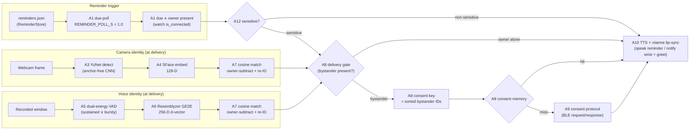

# Technical High-Level Design (HLD) — Algorithm-Centric

**Project:** Presence-Aware Social Robot with Watch-Mediated Consent
**Type:** MSc thesis prototype
**Organising axis:** the **algorithms** in the sensing → identity → decision → actuation
pipeline. Each processing stage is specified as an algorithm (model, parameters, thresholds,
measured latency, rationale, alternatives, reference).
**Companion document:** [Design HLD](design_hld.md) — goals, privacy model, decisions, GDPR.
**Evidence base:** [Algorithm Comparison](algorithm_comparison.md) — the empirical benchmark
and literature check that justify the choices below.
**Source map:** [Codebase Guide](codebase_guide.md) — entry points, modules, state schemas,
and current runtime caveats, including scheduled reminders.

---

## 1. Purpose and scope

This document describes the system from the point of view of **what algorithms it runs and
why those algorithms**. The prototype is, at its core, a **scheduled-reminder trigger**
feeding two small **identity pipelines** (camera / voice) and a **sensitivity-gated
consent-decision algorithm**, wrapped by a BLE consent protocol and a TTS/lip-sync actuator:

```
         trigger                       identity algorithm            decision algorithm
Reminder:  due-poll → owner present (BLE) ────────────────────────────────────┐
Camera:    YuNet detect → SFace embed → cosine match  ────────────────────────┼→ sensitivity +
Voice:     dual-energy VAD → Resemblyzer d-vector → cosine match  ─────────────┘   consent memory
                                                                                    → consent
                                                                                      protocol
                                                                                    → TTS + visemes
```

Every algorithm choice is driven by one binding non-functional requirement — **deployability
under a real-time budget** (one laptop holds a BLE link to the watch *and* a USB serial link
to the Ohbot at once) — so the selection is optimised for latency/memory/deploy-friction on
CPU, with accuracy as a secondary axis. See [§9](#9-benchmark-evidence--non-functional-behaviour).

---

## 2. Algorithmic pipeline overview



Only one identity chain is active per run (camera *or* voice); both share the reminder
trigger (A1), the sensitivity classifier (A12), the decision algorithms (A7–A9), and the
actuator (A10).

---

## 3. Algorithm specifications

Notation in each spec: **Role** (pipeline stage) · **Algorithm/model** · **Key parameters** ·
**Thresholds** · **Latency** (median on Apple M4, from the benchmark) · **Rationale &
alternatives** · **Reference**.

### 3.1 · A1 — Reminder due-trigger & owner-presence gate

| | |
| --- | --- |
| **Role** | Arming signal — fire when a scheduled reminder becomes *due* and the owner is present. (Replaces the removed heart-rate gate; there is no physiological sensing.) |
| **Algorithm** | Clock poll over the reminder store, ANDed with the watch BLE link as the owner-presence signal; a due reminder is **held** until the watch is in range. |
| **Where** | Laptop: `camera_*` / `voice_reminder.py` (the shared voice engine behind `mic_remember` / `mic_reask`) main loop over `reminders.json` (`ReminderStore`). Owner presence: `policy.py` `BangleClient.is_connected()`. |
| **Key parameters** | Camera apps re-read the store every `REMINDER_POLL_S = 1.0` s; the voice runner polls the clock every `--poll` (default 2.0 s) and opens its listening window `--lead` (default 300 s) before the due time. |
| **Logic** | `due ⇔ (¬delivered) ∧ (now ≥ remind_at)`; `fire ⇔ due ∧ watch.is_connected()`. A due-but-owner-absent reminder is held, not dropped, and retried when the watch returns. |
| **Rationale** | The reminder time is a deterministic, private trigger. Gating on the BLE link means a reminder is only surfaced when the owner is in the room (≈ 10 m) *and* reachable on the private consent channel; it need not be spoken to an empty room. |

### 3.2 · A2 — Camera presence indicator (operator HUD)

| | |
| --- | --- |
| **Role** | Cheap per-frame "how many faces are in view?" for the operator preview only. It **no longer triggers** a trial — the reminder does (A1); who is *actually* present for the decision is assessed at delivery time by A3/A4. |
| **Algorithm** | **Haar cascade** (Viola–Jones boosted cascade of Haar-like features) → face count + boxes drawn on the preview. |
| **Model** | OpenCV `haarcascade_frontalface_default.xml`. |
| **Key parameters** | `detectMultiScale(scaleFactor=1.2, minNeighbors=5, minSize=(60,60))` on greyscale. |
| **Latency** | **18.0 ms** median (p95 18.8, ~56 FPS). |
| **Rationale & alternatives** | Haar ships with OpenCV, needs no download, and is "good enough" for a live face count. With the reminder trigger, the earlier sliding-window vote (`OBSERVATION_WINDOW_S`, `FACE_VISIBLE_FRACTION_*`) and per-encounter re-arm/face-count machinery were removed. **Benchmark finding:** Haar is actually the *slowest* detector tested (cost scales with scanned windows); folding the HUD count into A3 (YuNet) would drop it entirely. Alternatives: **YuNet 5.2 ms**, MediaPipe BlazeFace 0.83 ms, SSD 9.5 ms, SCRFD 92 ms. |
| **Reference** | Viola & Jones 2001, [doi:10.1109/CVPR.2001.990517](https://doi.org/10.1109/CVPR.2001.990517). |

### 3.3 · A3 — Camera face detection (Stage 2, precise)

| | |
| --- | --- |
| **Role** | Precise face boxes + landmarks for alignment, at trial time only (in the worker thread, on a `frame.copy()`). |
| **Algorithm** | **YuNet** — anchor-free, edge-targeted millisecond-level CNN detector. |
| **Model** | `face_detection_yunet_2023mar.onnx` via `cv2.FaceDetectorYN` (auto-downloaded from opencv_zoo, ~0.2 MB weights). |
| **Key parameters** | `score_threshold = 0.9`, `nms_threshold = 0.3`, `top_k = 5000`; input size reset to the actual frame size per call. Emits bbox + 5-point landmarks + score. |
| **Latency** | **5.15 ms** median (p95 6.3, ~194 FPS, 102 MB RSS, init 18 ms). |
| **Rationale & alternatives** | Fixed small forward pass (content-independent), ships with OpenCV, and its landmarks feed SFace's `alignCrop`. MediaPipe is faster (0.83 ms) but returns no embedding-ready aligned crop and adds a download; SCRFD is 18× slower with ~0.8 GB RSS. |
| **Reference** | Wu, Peng & Yu 2023, [doi:10.1007/s11633-023-1423-y](https://doi.org/10.1007/s11633-023-1423-y) (paper: 1.6 ms/frame @320×320 on i7-12700K, 81.1 % mAP WIDER-hard). |

### 3.4 · A4 — Camera face embedding

| | |
| --- | --- |
| **Role** | Turn an aligned face crop into a comparable identity vector. |
| **Algorithm** | **SFace** (Sigmoid-Constrained Hypersphere loss) deep embedding — the FaceNet "embedding + cosine" family. |
| **Model** | `face_recognition_sface_2021dec.onnx` via `cv2.FaceRecognizerSF`; `alignCrop(frame, landmarks)` → `feature()`. |
| **Output** | **128-D `float32`, L2-normalised.** |
| **Latency** | **7.33 ms** median (p95 9.1, ~136 FPS, 229 MB RSS, 36.9 MB model). |
| **Rationale & alternatives** | 128-D is cheap to store/compare and ships with OpenCV (no `dlib`/CMake). Challenger **ArcFace 512-D** is the accuracy ceiling but **~11× slower (81 ms) and ~1.1 GB RSS** — untenable while the laptop drives BLE + serial. |
| **Reference** | Zhong, Deng et al. 2021, [doi:10.1109/TIP.2020.3048632](https://doi.org/10.1109/TIP.2020.3048632); family: Schroff et al. FaceNet 2015, [arXiv:1503.03832](https://arxiv.org/abs/1503.03832). |

### 3.5 · A5 — Voice presence detection (dual energy test)

| | |
| --- | --- |
| **Role** | Decide, from the continuously-recorded pre-reminder window, whether any non-owner voice was present — analysed **once**, at the due time. |
| **Algorithm** | **RMS short-term-energy** over 100 ms blocks, with a **dual OR test** tuned to catch a distant/quiet bystander: *sustained* (enough blocks over the gate) **OR** *bursty* (a few blocks over a louder peak). |
| **Key parameters** | Block = 100 ms @ `VOICE_SR = 16000`; `rms = √mean(x²)`. Sustained: `voiced_fraction ≥ VOICED_FRACTION_MIN = 0.06` over `RMS_GATE = 0.02`. Bursty: `≥ PEAK_MIN_BLOCKS = 2` blocks over `PEAK_RMS = 0.035`. `detected = sustained ∨ bursty`. Tunable via `--gate` / `--min-voiced` / `--peak`. |
| **Where** | `voice_reminder.py` `presence_metrics()` (the shared engine behind `mic_remember` / `mic_reask`), over the whole recorded window (default `--lead = 300 s`). |
| **Latency** | **< 0.01 ms** per block (~360k FPS, RTF ~0.0001) — effectively free. |
| **Rationale & alternatives** | Zero dependencies, trivially real-time. The bursty test catches a roommate talking across the room (measured voice peaks ~0.045–0.060 with an average ~0.007, which a single sustained gate misses). Because RMS/WebRTC/Silero are *all* far under budget, the choice among them is an **accuracy** question, not latency: `webrtcvad` is already installed (near-zero-cost robustness upgrade); Silero (0.09 ms) is the accuracy ceiling. |
| **Reference** | Classical energy VAD (statistical lineage Sohn et al. 1999). |

### 3.6 · A6 — Voice identity: segmentation + speaker embedding

| | |
| --- | --- |
| **Role** | Turn the recorded window into per-speaker identity vectors at delivery time, then average the non-owner windows into **one** bystander embedding (`identify_bystander_averaged`). |
| **Algorithm** | **Resemblyzer GE2E VoiceEncoder** ("d-vector"): internal **VAD-trim/resample** (`preprocess_wav`) then **partial-window utterance embedding** (`embed_utterance(return_partials=True)`). |
| **Key parameters** | Works at 16 kHz; one embedding per **~1.6 s partial window**; minimum voiced audio `_MIN_VOICED_S = 0.6` (else no windows → no speaker). All non-owner windows are mean-pooled into one stable ID per encounter (owner-plus-one assumption). |
| **Output** | **256-D `float32`, L2-normalised** per window. |
| **Latency** | **23.74 ms** per 6 s utterance (RTF 0.004, 379 MB RSS, weights bundled, init 14 ms). |
| **Rationale & alternatives** | Weights ship in the pip package (zero download, ~14 ms init) — the deployability win. Challengers download from HuggingFace: **ECAPA-TDNN** (31 ms, ~14 s init — accuracy SOTA) and **x-vector** (6 ms — actually the *fastest* embedder, a cheap upgrade candidate pending EER). |
| **Reference** | Wan et al. GE2E 2017, [arXiv:1710.10467](https://arxiv.org/abs/1710.10467). |

### 3.7 · A7 — Similarity, owner-subtraction & bystander re-identification

The single matching algorithm reused by **both** modalities (embedding-agnostic).

| | |
| --- | --- |
| **Role** | Decide, from embeddings, who is the owner (subtract) and give each remaining person a stable ID. |
| **Algorithm** | **Cosine similarity** + **thresholded nearest-neighbour** assignment against a persistent gallery, with monotonic ID minting. Owner template built by **mean-of-samples + re-normalisation**. |
| **Cosine** | `_cosine(a,b) = a·b / (‖a‖‖b‖)`, denominator guard `1e-12`; full normalisation so it works at 128-D **and** 256-D (this is what makes A7 modality-agnostic; the helper is duplicated in `face_db.py` and `owner.py`). |
| **Owner subtract** | `OwnerStore.matches(emb, threshold)`; among detected faces, the **max-similarity face above threshold** is the owner and is removed from the key. Thresholds: face `SFACE_OWNER_THRESHOLD = 0.50` (**well above** same-person 0.363), voice `VOICE_OWNER_THRESHOLD = 0.73` (**just above** same-speaker 0.70). Owner-bar gap tuned per modality's dominant error — see [Design HLD §9](design_hld.md#9-two-sensing-modalities-camera--voice). |
| **Bystander re-ID** | `FaceDB.identify(emb)`: `argmax` cosine over the gallery; if best ≥ `match_threshold` → return that `person_NNN` (**no write**); else **mint** `person_{next_id:03d}`, append, persist. Thresholds: face `SFACE_COSINE_SAME_PERSON = 0.363` (OpenCV-recommended), voice `VOICE_SAME_SPEAKER = 0.70`. |
| **Enrollment (template)** | `mean(np.stack(samples))` over N samples (face 12 @ ~300 ms apart; voice 20 over 2 s chunks), then L2-renormalise once at save. |
| **Complexity** | O(gallery size) per query — galleries are tiny (few people), so effectively O(1). No drift adaptation: a matched embedding is never updated. |
| **Rationale** | The deep-embedding + cosine + NN family is the standard, and the tighter/looser owner thresholds encode which error is more costly per modality (false owner-match corrupts the key for faces; missed owner window fires a spurious prompt for voice). |

### 3.8 · A8 — Delivery gating & consent-memory decision

| | |
| --- | --- |
| **Role** | At a due reminder, decide *what* to do (speak / withhold / ask) and remember it. |
| **Algorithm** | (a) **Sensitivity branch** (A12): non-sensitive ⇒ speak, done; (b) **single-fire delivery** guarded by `in_trial` + `mark_delivered` (each reminder fires once); (c) **key-derivation**; (d) **cache lookup** (cache-memory policy) or unconditional ask (re-consent baseline). |
| **Delivery predicate** | `due ∧ ¬delivered ∧ ¬in_trial ∧ watch.is_connected()` spawns the trial worker (A1). Then: *non-sensitive* → speak; *sensitive ∧ no bystander* (owner alone) → speak; *sensitive ∧ bystander* → cache/ask. |
| **Bystander sensing** | At delivery only: camera runs A3/A4/A7 on a `frame.copy()`; voice runs A5/A6/A7 on the recorded window. The BLE-present owner is subtracted; the remaining IDs form the key. |
| **Key derivation** | `bystander_id` = colon-joined **sorted, de-duplicated** set of non-owner IDs (e.g. `person_001:person_003`); `ConsentKey(bystander_id, content_type="reminder")` — **one shared** content type, so a bystander's Yes/No is reused across every reminder, not re-asked per item. |
| **Decision** | `store.get(key)`: `YES`→speak the reminder, `NO`→private note (`notify`) + neutral greet, **miss**→A9 then `store.put`. A **no-reply is never cached** (privacy-safe). The re-ask apps — `camera_reask.py` and its voice sibling `mic_reask.py` — omit the store entirely (always A9, never persist), the thesis re-consent / control condition; their remembering counterparts (`camera_remember` / `mic_remember`) keep the cache. This remember-vs-re-ask contrast is the same in both modalities (the 2×2). |
| **Rationale** | The reminder time fires the delivery; the sensitivity branch keeps everyday errands friction-free; the sorted-set key means "the same group of people" maps to one durable decision; a fired reminder is marked delivered so it never repeats. |

### 3.9 · A9 — Consent protocol (BLE request/response)

| | |
| --- | --- |
| **Role** | Round-trip a private Yes/No question to the watch, safely. |
| **Algorithm** | **Correlation-ID request/response** over Nordic UART, with chunked writes, a caller-blocking future, timeout, and privacy-safe fallback. |
| **Request** | `ask_consent` mints id `p<N>`; sends `\nconsent("p<N>","<msg>");\n` (`json.dumps`-encoded), split into **≤ 20-byte** GATT writes, `response=False`, **5 ms** inter-chunk delay. |
| **Response** | Watch replies `CONSENT:p<N>:YES|NO`; matched back to the pending `asyncio.Future` by id. |
| **Timeout / failure** | `CONSENT_TIMEOUT_S = 30.0` → `None`; a mid-prompt link drop resolves the future with `CancelledError` (distinct from a real `No`). **`None` ⇒ withhold and do NOT cache.** |
| **Watch side** | Idle screen shows *"Robot linked / consent ready"*; a prompt buzzes (`buzz(400)`) and shows `E.showPrompt({Yes:1,No:0})`, then `restoreScreen()` restores idle. A `uiSeq` token + one-shot `finish()` guarantee exactly one reply and neutralise a superseded prompt; an unanswered prompt auto-dismisses after `CONSENT_MS = 30000` **without** sending a reply (the laptop treats no-reply as withhold). The heart-rate handler (`setHRMPower`/`HRM`) and the `BPM:` broadcast were removed. |
| **Rationale** | Ids make the protocol robust to retries/stale replies; chunking is forced by Espruino's 20-byte NUS-RX cap on CoreBluetooth; the cancel-vs-No distinction keeps non-decisions out of the cache. |

### 3.10 · A10 — Speech synthesis & viseme lip-sync (actuation)

| | |
| --- | --- |
| **Role** | Speak the reminder (`deliver_reminder_spoken`: *"Here is your reminder. …"*) or the neutral withhold greeting (`behavior_withhold`: *"Hello there."*) with lip-sync + head motion (or an OS-voice fallback). |
| **Algorithm** | **espeak TTS** → `ohbotspeech.wav`; **amplitude-envelope viseme mapping** drives the lip motors in time with playback; head nod/turn accompanies. |
| **Key parameters** | `setSynthesizer("espeak")`, `setVoice("-v en-gb+f3")`; visemes at `VISEMESPERSEC = 20`; lip map `TOPLIP = 5 + val/2`, `BOTTOMLIP = 5 + val/3`; `move(HEADTURN,5)`, `move(HEADNOD,5)`; serial 19200 baud. macOS plays via `afplay` (shim). |
| **Fallback** | `NO_OHBOT=1` → `_speak_fallback`: macOS `say`, Linux `espeak` — robot-free. |
| **Rationale** | espeak is dependency-light and matches the upstream Ohbot SDK; deriving visemes from the wav envelope avoids a phoneme aligner. |

### 3.11 · A11 — Scheduled reminder creation & delivery

| | |
| --- | --- |
| **Role** | The system's **trigger source**: create time-stamped private content ahead of time, then deliver it at its due time through A7–A10. |
| **Creation** | `add_reminder.py` records `--seconds` (default 8) at 16 kHz, transcribes locally with Whisper `base.en`, extracts the date/time with `dateparser` (`search_dates`, `PREFER_DATES_FROM=future`), classifies sensitivity with A12, and asks for terminal confirmation. At confirm the owner may press **`s`** to flip the sensitivity label (`y` saves, `r` re-records, `q` quits). Stores a naive local ISO datetime (minute precision). |
| **Data** | `Reminder(id, text, remind_at, delivered, sensitive)` — IDs `rem_NNN`, `sensitive: bool \| None` (`None` = classify live at delivery). Persisted to `reminders.json` via `ReminderStore`. |
| **Trigger & hold** | A1 poll: a due, undelivered reminder fires only when `watch.is_connected()`; otherwise it is **held** until the owner (watch) is back in range. |
| **Delivery policy (A8)** | *Non-sensitive* → speak it (no presence check, no consent). *Sensitive + owner alone* → speak it. *Sensitive + bystander* → reuse the remembered Yes/No or ask the watch (A9); Yes → speak *"Here is your reminder. …"*; No / no-reply → push privately to the wrist (`notify("Reminder: …")`) and greet neutrally. Keyed by `ConsentKey(bystander_id, "reminder")`. |
| **Persistence** | `ReminderStore` uses atomic whole-file JSON writes. The camera apps mark a due item delivered after the attempt, **including on error** (at-most-once). The voice runner leaves a *transient* failure pending and retries up to `MAX_DELIVERY_ATTEMPTS = 3` before giving up. |
| **Limitations** | A silent/quiet bystander is indistinguishable from owner-alone; `notify(...)` has no acknowledgement; local-time timestamps have no timezone/DST migration. |

### 3.12 · A12 — Reminder sensitivity classification

| | |
| --- | --- |
| **Role** | Label each reminder **sensitive** (health/finance/personal → presence-gated) or **non-sensitive** (everyday errand → spoken freely). This is the switch that decides whether the consent machinery runs at all. |
| **Algorithm** | Same **embedding + cosine** family as A4/A6/A7: a **sentence-transformer** encodes the reminder text, scored by **cosine similarity** against small labelled prototype sets (sensitive vs everyday), plus a **high-precision keyword override** for explicit medical/financial terms. Runs **offline on CPU** — no cloud, no API key; the reminder text never leaves the device. |
| **Model** | `all-MiniLM-L6-v2` (~80 MB, cached locally after first download); a few ms per classification. |
| **Decision** | Sensitive iff the best sensitive-prototype cosine `≥ SENSITIVE_ABS_SIM = 0.42` and an everyday example does not clearly beat it (within `SENSITIVE_TIE = 0.04`), **or** a keyword matches. A genuine near-tie resolves to **sensitive** (privacy-safe); empty text → sensitive. |
| **Fallback** | If `sentence-transformers` is missing or cannot load offline, a transparent **keyword heuristic** takes over (and prints that it did). |
| **Where** | `sensitivity.py` (`classify`); run once at add time (`add_reminder.py`), or lazily at delivery for reminders saved before the field existed. |
| **Reference** | Same deep-embedding + cosine lineage as A4/A6 (FaceNet / GE2E families); model card `all-MiniLM-L6-v2`. |

---

## 4. Where each algorithm runs (thread & timing)

| Algorithm | Thread | Cadence |
| --- | --- | --- |
| A1 reminder due-poll + owner-presence | main loop | poll (`REMINDER_POLL_S`; voice `--poll`) |
| A2 Haar face count (HUD) | main loop | every frame (camera preview only) |
| A5 dual-energy VAD | voice runner | once, over the recorded window |
| A3 YuNet, A4 SFace, A6 Resemblyzer | **trial worker (daemon)** | **only at delivery (trial) time** |
| A7 cosine/re-ID | trial worker | at delivery time |
| A8 gating | main loop | reminder poll |
| A8 decision + memory, A9 protocol, A10 TTS | trial worker | at delivery time |
| A11 reminder store | main + worker | clock poll; mic/cam gated |
| A12 sensitivity classifier | add time / lazy | once per reminder |

**Design rule:** the *cheap* work (the A1 clock-poll, A2 HUD count) stays on the main loop;
the *heavy* algorithms (A3/A4/A6 CNNs, A7 matching) run **only at delivery time** on a
`frame.copy()` / recorded window, off the UI thread, so the preview loop never blocks on a
CNN, a 30 s BLE round-trip, or the length of the recorded window.

---

## 5. Algorithm parameter & threshold reference

| Constant | Value | Algorithm | Meaning |
| --- | --- | --- | --- |
| `REMINDER_POLL_S` | 1.0 | A1 | Camera store-poll cadence |
| `--poll` (voice) | 2.0 | A1 | Voice clock-poll cadence while idle |
| `--lead` (voice) | 300 | A1 | Continuous listening window before due time |
| `scaleFactor / minNeighbors / minSize` | 1.2 / 5 / 60² | A2 | Haar HUD-count tuning |
| `score / nms / top_k` | 0.9 / 0.3 / 5000 | A3 | YuNet detection |
| SFace dim | 128 | A4 | Face embedding size |
| `SFACE_OWNER_THRESHOLD` | 0.50 | A7 | Face owner match (tight) |
| `SFACE_COSINE_SAME_PERSON` | 0.363 | A7 | Face same-person re-ID |
| `VOICE_SR` / block | 16000 / 100 ms | A5/A6 | Audio rate / block |
| `RMS_GATE` | 0.02 | A5 | Sustained-speech gate (`--gate`) |
| `VOICED_FRACTION_MIN` | 0.06 | A5 | Sustained-test voiced fraction (`--min-voiced`) |
| `PEAK_RMS` / `PEAK_MIN_BLOCKS` | 0.035 / 2 | A5 | Bursty-test peak / min loud blocks (`--peak`) |
| `~1.6 s` window / `_MIN_VOICED_S` | 1.6 / 0.6 | A6 | Resemblyzer partial / min voiced |
| Resemblyzer dim | 256 | A6 | Speaker embedding size |
| `VOICE_OWNER_THRESHOLD` | 0.73 | A7 | Voice owner match (just above same-speaker) |
| `VOICE_SAME_SPEAKER` | 0.70 | A7 | Voice same-speaker re-ID |
| `CONSENT_TIMEOUT_S` | 30.0 | A9 | Watch-reply timeout → withhold |
| chunk / delay | 20 B / 5 ms | A9 | NUS-RX write chunking |
| `VISEMESPERSEC` | 20 | A10 | Lip-sync sampling rate |
| `MODEL_NAME` | all-MiniLM-L6-v2 | A12 | Sensitivity text encoder |
| `SENSITIVE_ABS_SIM` / `SENSITIVE_TIE` | 0.42 / 0.04 | A12 | Sensitive cosine bar / near-tie margin |

---

## 6. Data representations produced by the algorithms

| Representation | Producer | Shape / persistence |
| --- | --- | --- |
| Face embedding | A4 SFace | 128-D `float32` L2-norm (in-memory `DetectedFace`) |
| Voice embedding | A6 Resemblyzer | 256-D `float32` L2-norm (in-memory `DetectedVoice`) |
| Owner template | A7 enrollment | mean+renorm embedding → `owner_face.json` / `owner_voice.json` (base64 float32) |
| Bystander gallery | A7 re-ID | `{next_id, people:[{id, embedding}]}` → `face_db.json` / `voice_db.json` |
| Consent record | A8 memory | `{bystander_id: {content_type: "YES"|"NO"}}` → `consent_cache*.json` |
| Reminder | A11/A12 | `{id, text, remind_at, delivered, sensitive}` → `reminders.json` (naive local time; `sensitive: bool\|None` set by A12) |

The biometric galleries/templates, consent caches, and `reminders.json` all live under
the gitignored `robot/state/` directory and are per-machine (never committed). All
stores are written atomically (`tempfile.mkstemp` → `os.replace`). Camera and voice keep
**independent** identity files, so a voice `person_001` and a face `person_001` are
unrelated identities.

---

## 7. Interfaces & protocols (condensed)

**Watch ⇄ laptop — BLE Nordic UART Service.** NUS RX (notify, watch→laptop)
`6e400003-…`; NUS TX (write, laptop→watch) `6e400002-…`. Frames: `CONSENT:<id>:YES|NO`
inbound — the *only* inbound frame now (the heart-rate `BPM:<n>` broadcast was removed);
`\nconsent("<id>","<msg>");\n` outbound (the A9 protocol). The one-way sibling
`\nnotify("<msg>");\n` displays a private note and provides no delivery acknowledgement.
Strings are JSON-encoded and written in ≤ 20-byte chunks.

**Laptop ⇄ Ohbot — USB serial** @ 19200 baud, latin-1 ASCII (`move`/`say`/`reset`/`close`;
the A10 actuator).

**Capture** — `cv2.VideoCapture(0)` (A2/A3 input); `sounddevice.InputStream` 16 kHz mono
100 ms blocks (A5/A6 input).

Full wire-level detail (chunking, encoding, line hygiene, watch UI states) is in A9/§3.9 and
the [Design HLD](design_hld.md).

---

## 8. Concurrency model (condensed)

Contexts: **main thread** (capture / clock-poll + A2 HUD + A8 gating), **BLE thread**
(asyncio, A9), **trial worker (daemon)** (A3/A4/A6/A7 + A8 decision/memory + A9 + A10, at
delivery). The voice runner records the pre-reminder window with `sounddevice` in the
background and runs the A5 dual-energy analysis + A6 embedding at the due time (no persistent
audio-callback thread).

| Shared resource | Guard | Rule |
| --- | --- | --- |
| Ohbot SDK (not thread-safe) | `ohbot_lock` | Every `ohbot.*` under the lock |
| Trial (delivery) slot | `trial_lock` | Claim `in_trial` **and** spawn the worker atomically (no double-fire; the reminder is then `mark_delivered`) |
| Consent cache / reminder store | per-object locks | Reader/writer safety; atomic temp-file + `os.replace` |
| Shutdown | `shutting_down` Event | Worker checks before long ops; `watch.close()` cancels pending A9 future |

Heavy algorithms run on the daemon worker against a `frame.copy()`/audio snapshot so they
never race the live capture buffer.

---

## 9. Benchmark evidence & non-functional behaviour

The `robot/bench/` harness measures each candidate **in its own subprocess**
(one model per process → clean peak-RSS, crash isolation, no cache cross-contamination),
reporting **median + p95** after warmup. Accuracy/EER is fully wired
(`equal_error_rate`, d-prime) but **pending a labelled eval set** (`capture_eval_set.py`).

| Stage | Shipped algorithm | Median latency | Peak RSS | Nearest challenger |
| --- | --- | --- | --- | --- |
| Presence (cam) | A2 Haar | 18.0 ms | 111 MB | YuNet 5.2 ms |
| Detect (cam) | A3 YuNet | 5.2 ms | 102 MB | MediaPipe 0.83 / SCRFD 92 |
| Embed (cam) | A4 SFace 128-D | 7.3 ms | 229 MB | ArcFace 512-D 81 ms / 1.1 GB |
| VAD (voice) | A5 RMS | < 0.01 ms | 199 MB | WebRTC ~0 / Silero 0.09 |
| Embed (voice) | A6 Resemblyzer 256-D | 23.7 ms | 379 MB | x-vector 6.0 / ECAPA 31 ms |

*(Apple M4, VGA / 16 kHz. Full tables, citations, and the literature-gap analysis in
[Algorithm Comparison](algorithm_comparison.md).)*

**Headline algorithmic findings:** (1) latency is not the binding constraint for the
lightweight stack — every shipped choice is comfortably real-time; it bites only for the
SOTA challengers (SCRFD/ArcFace push RSS to ~1 GB). (2) The "cheap" **A2 Haar is the slowest
detector** — folding it into A3 YuNet would simplify the pipeline with no latency cost.
(3) **x-vector is the fastest speaker embedder** — a cheap A6 upgrade pending EER. (4) VAD
choice (A5) is an accuracy, not latency, decision — WebRTC is a near-free robustness upgrade.

---

## 10. Deployment

```
python3 -m venv .venv && source .venv/bin/activate
pip install -r requirements.txt        # + system espeak; PortAudio on Linux
# flash bangle/consent_app.js via Espruino Web IDE, then DISCONNECT the IDE
# run apps as modules from the repo root
python -m robot.apps.enroll_face            # or -m robot.apps.enroll_voice   (A7 template)
python -m robot.apps.add_reminder      # create a scheduled reminder by voice (A11 + A12)
python -m robot.apps.camera_remember    # camera, reminder-triggered, remembers | -m robot.apps.camera_reask = re-ask baseline
python -m robot.apps.mic_remember       # voice, reminder-triggered, remembers (mic opens only when a reminder is due) | -m robot.apps.mic_reask = re-ask baseline
#   the four delivery apps are a 2x2 of modality (camera / mic) x consent policy (remember / re-ask); the mic apps are thin wrappers over robot/core/voice_reminder.py
#   NO_OHBOT=1 → run without the robot (A10 fallback);  OHBOT_PORT=… → serial hint
#   VOICE_INPUT_DEVICE=… → mic index or name substring
#   (robot/core/robot_io.py is a shared support module, not a runnable entry point)
```

**Tech stack:** CPython 3.13; `bleak` (BLE), `opencv-python` (A2/A3/A4), `sounddevice`+PortAudio
(A5/A6 capture), `resemblyzer`+`torch` (A6), Whisper+dateparser (A11 creation),
`sentence-transformers` (A12), `ohbot`+`pyserial` (A10), espeak/`say` (TTS).
YuNet+SFace ONNX (~37 MB) auto-download on first run; Resemblyzer weights ship in-package;
Whisper `base.en` (~74 MB) and the A12 encoder (~80 MB) download to their caches on first use.

---

## 11. Known limitations & technical debt

| # | Item | Algorithm | Impact |
| --- | --- | --- | --- |
| 1 | Sensitivity classifier can mislabel a reminder | A12 | A *sensitive→non-sensitive* miss is spoken freely; mitigated by near-tie→sensitive, the keyword override, and the owner's `s` flip at add time. |
| 2 | Haar HUD count is the slowest detector | A2 | Wasted latency for a preview-only count; drop it / fold into A3 YuNet. |
| 3 | Gallery never adapts a matched embedding | A7 | No drift adaptation / re-clustering / ID merge; first-seen embedding is frozen. |
| 4 | `_cosine` duplicated verbatim | A7 | Candidate for a shared embedding-utils module. |
| 5 | Owner-in-frame but SFace mis-match | A7 | Owner can be minted as a bystander ID; re-enroll if frequent. |
| 6 | Whole-window voices are averaged into one ID | A6 | Two different bystanders speaking in the same window merge into a single ID (accepted for the owner-plus-one case). |
| 7 | Accuracy / EER numbers pending | A2–A7 | Only latency/memory measured; eval set not yet recorded. |
| 8 | Upstream Ohbot SDK truthiness bug | A10 | `"espeak" or …` always truthy in the installed SDK; cosmetic for our path. |
| 9 | Reminder delivery is not guaranteed | A11 | Camera marks a due item delivered after the attempt (at-most-once, incl. on error); the voice runner retries up to `MAX_DELIVERY_ATTEMPTS = 3` then gives up. |
| 10 | Quiet/silent bystander treated as owner-alone | A5/A11 | A bystander who stays silent (or too faint for the dual energy test) is missed and sensitive content may be spoken. |
| 11 | `notify(...)` is unacknowledged | A9/A11 | The laptop cannot distinguish displayed, dropped, or unacknowledged private notes. |

---

## 12. Traceability

| Algorithm(s) | File(s) |
| --- | --- |
| A1 | `robot/core/reminders.py`, `robot/core/voice_reminder.py` (behind `mic_remember` / `mic_reask`), `robot/apps/camera_*` reminder poll; owner-presence `robot/core/policy.py` (`BangleClient.is_connected`) |
| A2 (HUD), A8 gating | `robot/apps/camera_{remember,reask}.py` |
| A3, A4 | `robot/perception/face_id.py` |
| A5, A6 | `robot/perception/voice_id.py`, `robot/core/voice_reminder.py`, `robot/core/robot_io.py` (support) |
| A7 | `robot/perception/face_db.py`, `robot/core/owner.py`, `robot/apps/enroll_{face,voice}.py` |
| A8 decision + memory, A9 | `robot/core/policy.py`, `bangle/consent_app.js`; delivery in `robot/apps/camera_*` `run_reminder_policy` / `robot/core/voice_reminder.py` `monitor_and_deliver` |
| A10 | `ohbot` SDK, `robot/apps/camera_*` `deliver_reminder_spoken/behavior_withhold` |
| A11 | `robot/apps/add_reminder.py`, `robot/core/voice_reminder.py`, `robot/core/reminders.py` |
| A12 | `robot/core/sensitivity.py` |
| Evidence | `robot/bench/*`, `docs/algorithm_comparison.md` |

*See the [Design HLD](design_hld.md) for goals, the privacy/consent model, decision rationale,
threat model, and GDPR mapping.*
